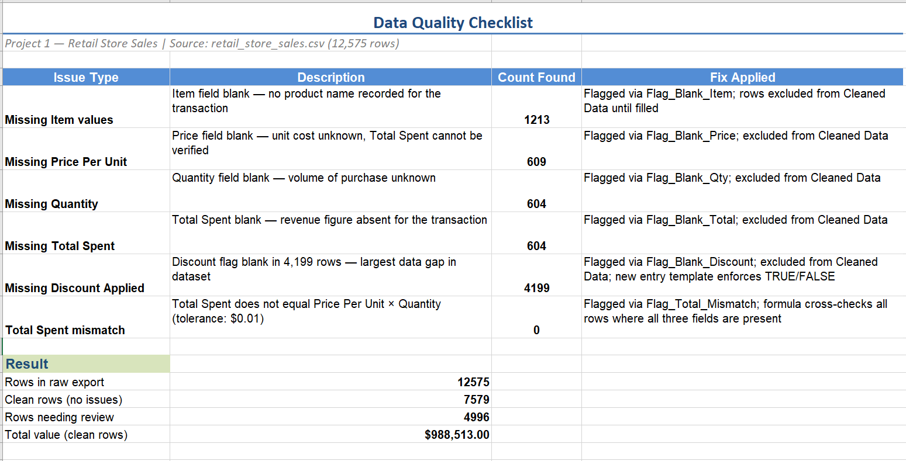
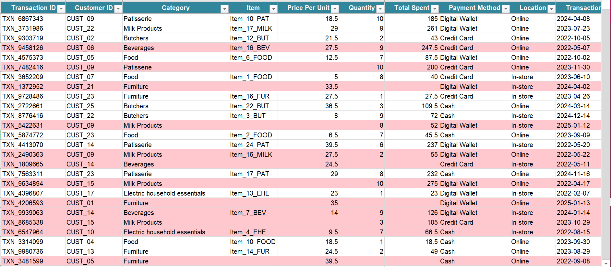
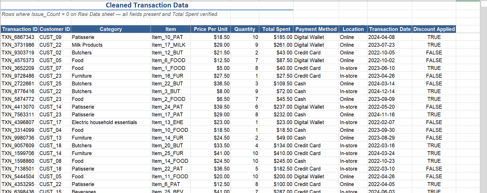
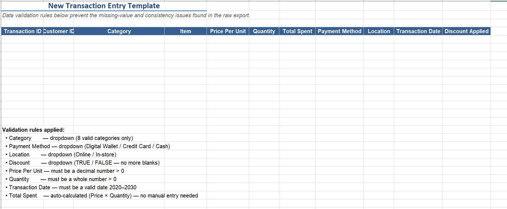

# Project 1 — Data Cleaning & Validation

**Skill demonstrated:** Perform data cleaning and validation to ensure accuracy and consistency.

---

## Business question
A raw retail store sales export arrived with thousands of missing values across
key fields — product names, prices, quantities, and discount flags — making it
unreliable for reporting or decision-making.

The goal was to identify every data quality issue, clean and standardize the
affected fields, flag and isolate incomplete rows, and deliver a clean dataset
ready for analysis — plus put a system in place to prevent the same problems
from recurring.

---

## Dataset
**Dirty Retail Store Sales** — [Kaggle](https://www.kaggle.com/datasets/ahmedmohamed2003/retail-store-sales-dirty-for-data-cleaning)
- 12,575 rows of synthetic retail transaction data
- 11 columns: Transaction ID, Customer ID, Category, Item, Price Per Unit,
  Quantity, Total Spent, Payment Method, Location, Transaction Date, Discount Applied
- License: CC BY-SA 4.0

---

## Dataset fields

| Field | Data Type | Notes |
|-------|-----------|-------|
| Transaction ID | Text | Unique identifier per transaction e.g. `TXN_6867343` |
| Customer ID | Text | Repeats — one customer can have multiple transactions |
| Category | Text | 8 categories e.g. `Patisserie`, `Furniture`, `Beverages` |
| Item | Text | Product code e.g. `Item_10_PAT` — **1,213 blanks** |
| Price Per Unit | Decimal | Unit cost — **609 blanks** |
| Quantity | Decimal | Stored as decimal, not whole number — **604 blanks** |
| Total Spent | Decimal | Should equal Price × Quantity — **604 blanks** |
| Payment Method | Text | `Digital Wallet`, `Credit Card`, or `Cash` |
| Location | Text | `Online` or `In-store` |
| Transaction Date | Text | Stored as `YYYY-MM-DD` string — converted to a real date using `DATEVALUE` |
| Discount Applied | Boolean | `TRUE` or `FALSE` — **4,199 blanks**, largest gap in dataset |

**Data type issues addressed in the workbook:**
- **Transaction Date** is stored as plain text, meaning Excel would sort it alphabetically rather than chronologically. A `DATEVALUE` formula converts it to a proper date.
- **Quantity** is stored as a decimal, meaning the source system could record `2.5` units. The New Entry Template enforces whole numbers only via data validation.

---

## Issues found

| Issue | Count | Result |
|-------|-------|--------|
| Missing Item values | 1,213 | Flagged — rows excluded |
| Missing Price Per Unit | 609 | Flagged — rows excluded |
| Missing Quantity | 604 | Flagged — rows excluded |
| Missing Total Spent | 604 | Flagged — rows excluded |
| Missing Discount Applied | 4,199 | Flagged — rows excluded |
| Total Spent ≠ Price × Quantity | 0 | ✅ No mismatches found |
| Duplicate Transaction IDs | 0 | ✅ No duplicates found |
| Extra spaces — Transaction ID | 0 | ✅ TRIM applied — none found |
| Extra spaces — Customer ID | 0 | ✅ TRIM applied — none found |
| Extra spaces — Category | 0 | ✅ TRIM applied — none found |
| Extra spaces — Payment Method | 0 | ✅ TRIM applied — none found |
| Extra spaces — Item | 0 | ✅ TRIM applied — none found |
| Extra spaces — Location | 0 | ✅ TRIM applied — none found |
| **Total rows flagged** | **4,996** | |
| **Clean rows** | **7,579** | |

> TRIM was applied across all text fields as standard practice. No extra spaces
> were found in this dataset, confirming the export was clean in that regard.
> Duplicate checks and Total Spent cross-validation were also run — both clear.

---

## Workbook structure

### 1. Data Quality Checklist
Documents every issue checked, the count found, and the fix applied.
Results update automatically if the raw data changes.



---

### 2. Raw Data
The original 12,575 rows with seven cleaning columns (L–R) and thirteen flag
columns (S–AE) added to the right. Rows with any issue are highlighted in red.



---

### 3. Cleaned Data
Only the 7,579 rows that passed all checks. Pulled automatically from Raw Data
using INDEX/MATCH — no copy-paste. Uses TRIM-cleaned versions of Category,
Item, Payment Method, and Location.



---

### 4. New Entry Template
A blank form for entering new transactions going forward. Dropdown lists and
validation rules are built in so the same data quality problems cannot recur.



---

## How the cleaning works

### Step 1 — Apply TRIM to all text fields (columns L–O)

TRIM was applied to every text column as a standard first step, even before
checking for issues. This ensures no hidden spaces affect lookups, grouping,
or any downstream analysis.

TRIM is applied to **every text field without exception**. Extra spaces in an ID
field are particularly dangerous — `"TXN_6867343"` and `" TXN_6867343"` look
identical on screen but will silently break any VLOOKUP or MATCH trying to find
that record.

| Column | Name | Formula | Field cleaned |
|--------|------|---------|---------------|
| L | Clean_Transaction_ID | `=TRIM(A2)` | Transaction ID |
| M | Clean_Customer_ID | `=TRIM(B2)` | Customer ID |
| N | Clean_Category | `=TRIM(C2)` | Category |
| O | Clean_Payment_Method | `=TRIM(H2)` | Payment Method |
| P | Clean_Item | `=TRIM(D2)` | Item |
| Q | Clean_Location | `=TRIM(I2)` | Location |
| R | Clean_Transaction_Date | `=DATEVALUE(J2)` | Transaction Date (text → real date) |

**What TRIM does:** removes all leading and trailing spaces from a cell value.
> `"  Credit Card  "` → `"Credit Card"`

**Result:** No extra spaces were found in any column in this dataset.
The TRIM check confirms the source export was consistently formatted.

---

### Step 2 — Flag every issue (columns P–Z)

| Column | Flag | What it checks |
|--------|------|----------------|
| S | Flag_Blank_Item | Is Item missing? |
| T | Flag_Blank_Price | Is Price Per Unit missing? |
| U | Flag_Blank_Qty | Is Quantity missing? |
| V | Flag_Blank_Total | Is Total Spent missing? |
| W | Flag_Blank_Discount | Is Discount Applied missing? |
| X | Flag_Total_Mismatch | Does Price × Quantity ≠ Total Spent? |
| Y | Flag_Duplicate | Does this Transaction ID appear more than once? |
| Z | Flag_Spaces_TxnID | Does raw Transaction ID differ from TRIM result? |
| AA | Flag_Spaces_CustID | Does raw Customer ID differ from TRIM result? |
| AB | Flag_Spaces_Category | Does raw Category differ from TRIM result? |
| AC | Flag_Spaces_Payment | Does raw Payment Method differ from TRIM result? |
| AD | Flag_Spaces_Item | Does raw Item differ from TRIM result? |
| AE | Flag_Spaces_Location | Does raw Location differ from TRIM result? |

---

### Step 3 — Count and label (columns AA, AB)

| Column | Name | Formula | What it does |
|--------|------|---------|-------------|
| AF | Issue_Count | `=COUNTIF(S2:AE2,TRUE)` | Counts how many flags are TRUE |
| AG | Row_Status | `=IF(AF2=0,"Clean","Needs Review")` | Labels the row |

---

## How the conditional formatting rule works

The red highlight on the Raw Data sheet is controlled by one formula
applied across columns A to K:

```
=$AG2="Needs Review"
```

| Part | Meaning |
|------|---------|
| `=` | Tells Excel this is a formula |
| `$AG` | Always check column AG (Row_Status) — `$` locks the column |
| `2` | Row number — no `$` so it slides down automatically for each row |
| `="Needs Review"` | If true, apply the red fill |

**The full chain:**
```
Dirty or empty cell         →  Flag column = TRUE
One or more flags TRUE      →  Issue_Count (AF) > 0
Issue_Count > 0             →  Row_Status (AG) = "Needs Review"
Row_Status = "Needs Review" →  Row turns red
```

Fix a blank cell and the row automatically clears from red to white.

---

## New Entry Template explained

Seven built-in rules prevent the same errors recurring in future data entry:

| Field | Rule |
|-------|------|
| Category | Dropdown — 8 valid categories only |
| Payment Method | Dropdown — Digital Wallet, Credit Card, or Cash only |
| Location | Dropdown — Online or In-store only |
| Discount Applied | Dropdown — TRUE or FALSE only (no more blanks) |
| Price Per Unit | Must be a number greater than 0 |
| Quantity | Must be a whole number greater than 0 |
| Transaction Date | Must be a valid date between 2020 and 2030 |
| Total Spent | Auto-calculated (Price × Quantity) — no manual entry needed |

> The Raw Data sheet shows what went wrong in the past.
> The New Entry Template prevents it from happening in the future.

---

## Files
- `raw-data/retail_store_sales.csv` — original dataset from Kaggle
- `data-cleaning.xlsx` — workbook with all four sheets
- `screenshots/` — views of each sheet
