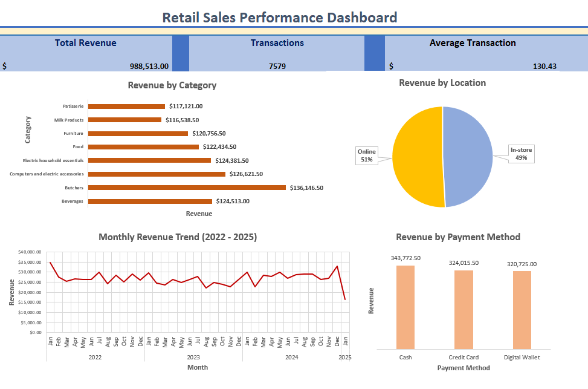

# Project 2 — Pivot Tables & Interactive Dashboard

**Skill demonstrated:** Create pivot tables, charts, and dashboards to present key metrics.

---

## Business question
Leadership needs a one-page, at-a-glance view of retail sales performance
by category, location, and payment method — with the ability to understand
revenue trends over time without touching any formulas.

---

## Dataset
This project uses the same Dirty Retail Store Sales dataset from Project 1.
The cleaned output (7,579 rows) is the source for this dashboard, demonstrating
an end-to-end workflow — clean first, then analyse.

> 4,996 rows were excluded during cleaning in Project 1 due to missing values.
> Only complete, validated records are used here.

**Source:** [Kaggle](https://www.kaggle.com/datasets/ahmedmohamed2003/retail-store-sales-dirty-for-data-cleaning)
- 7,579 clean rows (filtered from 12,575 raw)
- License: CC BY-SA 4.0

---

## Fields used in this dashboard

| Field | Type | Role in dashboard |
|-------|------|-------------------|
| Category | Text | Revenue by Category chart; PivotTable row label |
| Location | Text | Online vs In-store pie chart; PivotTable row label |
| Payment Method | Text | Revenue by Payment Method chart; PivotTable row label |
| Transaction Date | Date | Monthly trend chart; grouped by month in PivotTable |
| Total Spent | Decimal | Primary measure — summed across all PivotTables |
| Transaction ID | Text | Transaction count KPI card |

---

## Dashboard

---

## What the dashboard shows

| Element | Type | Insight |
|---------|------|---------|
| Total Revenue | KPI card | $988,513 across all clean transactions |
| Total Transactions | KPI card | 7,579 clean rows |
| Avg Transaction | KPI card | $130.43 per transaction |
| Revenue by Category | Bar chart | Butchers leads at $136k; Milk Products lowest at $117k |
| Revenue by Location | Pie chart | Online 51% ($503k) vs In-store 49% ($486k) |
| Revenue by Payment Method | Bar chart | Cash leads ($344k), Digital Wallet lowest ($321k) |
| Monthly Revenue Trend | Line chart | 37 months Jan 2022 – Jan 2025; consistent $22k–$30k band |

> **Note:** January 2025 shows a sharp drop to ~$15k. This reflects partial
> month data — the dataset does not cover the full month of January 2025.

---

## Workbook structure

The file `pivot-dashboard.xlsx` has four sheets:

### 1. Data
All 7,579 clean rows from Project 1 — the single source of truth for all
four PivotTables. Keeping data on a dedicated sheet ensures PivotTables
always refresh from one consistent source.

### 2. PivotTables
Four PivotTables built from the Data sheet, each summarising a different
dimension of the sales data:

| PivotTable | Rows | Values | Purpose |
|------------|------|--------|---------|
| Revenue by Category | Category | Sum of Total Spent | Feeds the category bar chart |
| Revenue by Location | Location | Sum of Total Spent | Feeds the pie chart |
| Revenue by Payment Method | Payment Method | Sum of Total Spent | Feeds the payment bar chart |
| Monthly Revenue | Transaction Date (grouped by month) | Sum of Total Spent | Feeds the trend line chart |

### 3. Charts
Four charts built from the PivotTables — moved to a dedicated chart sheet
to keep the PivotTables sheet clean and the dashboard uncluttered.

### 4. Dashboard
One-page view combining the KPI cards and all four charts. Grid lines are
hidden for a clean, report-ready appearance.

---

## How PivotTables work

A PivotTable summarises a large dataset into a compact table without writing
any formulas. You drag fields into rows, columns, and values — Excel does
the aggregation automatically.

**Example — Revenue by Category PivotTable:**

| Row Labels | Sum of Total Spent |
|---|---|
| Beverages | $124,513.00 |
| Butchers | $136,146.50 |
| Computers and electric accessories | $126,621.50 |
| ... | ... |

- **Row Labels** → Category field dragged into Rows
- **Sum of Total Spent** → Total Spent dragged into Values, set to Sum

**Key advantage:** PivotTables refresh automatically when the source data
changes — click **Refresh All** and every chart and summary updates instantly.

---

## How the monthly trend works

The Monthly Revenue PivotTable groups Transaction Date by month automatically:

1. Transaction Date is dragged into Rows
2. Right-click any date → **Group** → select **Months** and **Years**
3. Excel creates month-year groupings (Jan 2022, Feb 2022, etc.)
4. Total Spent is dragged into Values → set to Sum

This ensures months appear in chronological order on the chart x-axis —
avoiding the alphabetical sorting issue that occurs when dates are stored
as text.

---

## How the charts connect to PivotTables

Each chart is a **PivotChart** — built directly from a PivotTable. This means:
- The chart updates automatically when the PivotTable refreshes
- The chart and PivotTable always stay in sync
- No manual data range selection needed

| Chart | Source PivotTable | Chart type |
|-------|-------------------|------------|
| Revenue by Category | Revenue by Category | Horizontal bar |
| Revenue by Location | Revenue by Location | Pie |
| Revenue by Payment Method | Revenue by Payment Method | Vertical bar |
| Monthly Revenue Trend | Monthly Revenue | Line |

---

## Key findings

- **Revenue is evenly spread** across all 8 categories — the gap between
  highest (Butchers $136k) and lowest (Milk Products $117k) is only $19k.
  No single category dominates, suggesting a balanced product mix.
- **Online and In-store are nearly equal** at 51% vs 49%. Neither channel
  has a significant advantage — both deserve continued investment.
- **All three payment methods are within $23k of each other** — Cash ($344k),
  Credit Card ($324k), Digital Wallet ($321k). No payment type dominates.
- **Monthly revenue is stable** — after a high opening month in Jan 2022
  (~$35k), revenue settled into a consistent $22k–$30k band through 2023
  and 2024, suggesting a mature, steady business.

---

## Design decisions

| Decision | Reason |
|----------|--------|
| 4 separate sheets | Separates data, logic, charts, and presentation for easy navigation |
| PivotTables over SUMIF | Auto-refresh on data change; native connection to PivotCharts |
| PivotCharts | Stay in sync with PivotTables automatically — no manual updates |
| Grid lines hidden on Dashboard | Gives a clean, presentation-ready appearance |
| KPI cards at the top | Most important numbers visible first before charts |

---

## Files
- `raw-data/retail_store_sales.csv` — source dataset (same as Project 1)
- `pivot-dashboard.xlsx` — workbook with Data, PivotTables, Charts, and Dashboard sheets
- `screenshots/Retail_Performance_Dashboard.png` — dashboard view
